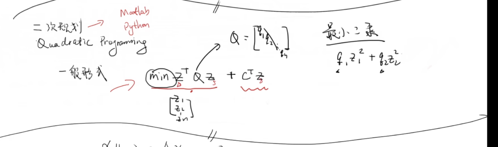
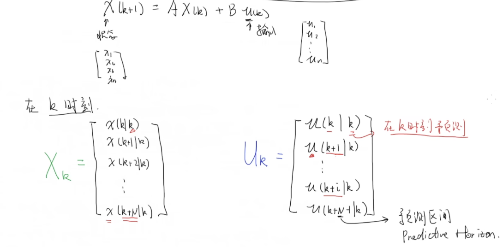
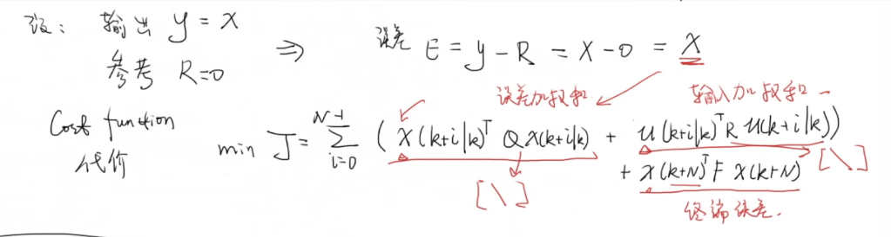
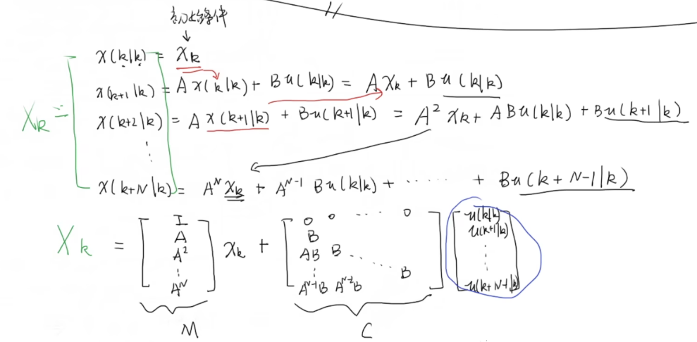
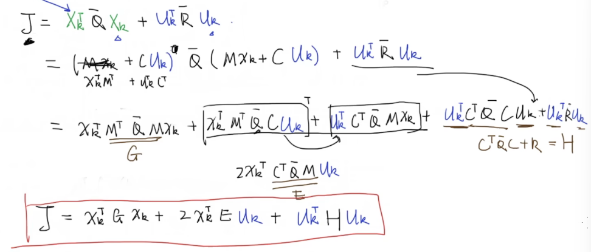
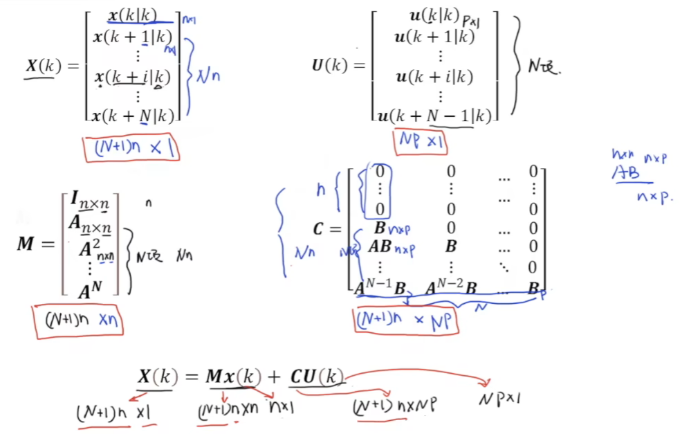
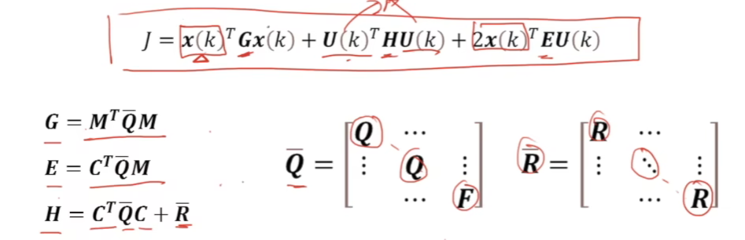

# Main Takeaway

MPC 模型预测控制

# MPC

model predictive control

## 基本概念

- 最优化控制

- MPC：通过模型来预测系统在某一未来时间段内的表现来进行优化控制

  多用于数位控制，用离散型状态空间表达$x_{k+1}=Ax_k+Bu_k$

  MPC实现过程：

  1. 估计/测量读取当前系统状态

  2. 基于$u_k,u_{k+1}...u_{k+N}$来进行最优化

     定义cost func $J$

  3. 只取$u_k$，进行滚动优化控制(receding horizon control)

## 最优化建模数学推导

做最优化的方法有很多，在这里只介绍二次规划

------

> 二次规划：二次型+线型，二次规划有自己的求解算法
>
> [优化理论——二次规划](https://zhuanlan.zhihu.com/p/375762164)

将二次规划应用于MPC中

初始定义如下：

定义cost func J

------

递推法得到预测状态$X_k$

$$
X_k=Mx_k+CU_k,x_k为初始状态
$$
化简上述的$J$，然后代入$X_k$得到

于是现在$J$和上述二次规划的形式一样，第一项$x_k^TGx_k$的$x_k$是初始状态不影响最优化，因此现在我们可以使用求解二次规划的问题来计算$\min J$得到相应的$u_k$

## 总结

# References

【【MPC模型预测控制器】1_最优化控制和基本概念】https://www.bilibili.com/video/BV1cL411n7KV?vd_source=93bb338120537438ee9180881deab9c1

 