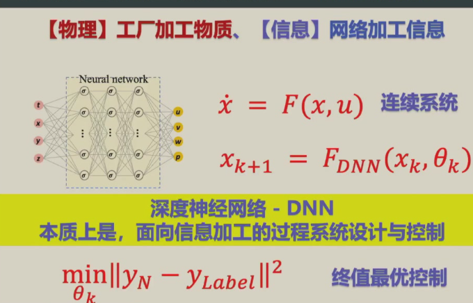
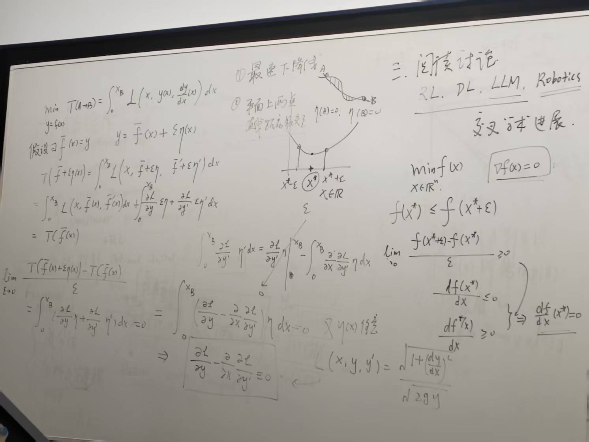
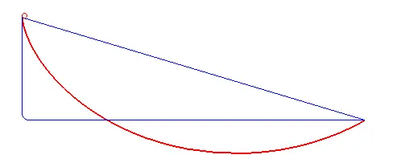

# Main Takeaway

配套CMU-16-745 Optimal Control and Reinforcement Learning食用

<!--more-->

# ZJU-Optimization & Optimal Control

## Lec 1 intro

上两节同学讲一节

- 深度学习的控制论视角——PID加速优化训练框架（PIDAO）

  

  深度神经网络反馈机制缺失

  本质上是一个高纬度的参数优化问题

  多用连续求解（方法多）再离散化

- 瓦特改进[蒸汽机离心调速器原理与应用](https://blog.csdn.net/u013414501/article/details/82428094)——相当于加了反馈

nature-inspired computing

主要介绍两个部分

- 优化optimization——finite 

  - unconstrained opt——PID
  - constrained opt
  - linear programming
  - nonlinear programming——NLP

- 最优控制optimal control——infinite dimensioned optimization

  - 变分法

  - 分析力学建模

  - PMP[module3.pdf (nd.edu)](https://www3.nd.edu/~lemmon/courses/ee565/lectures/module3.pdf)

    [https://www.cimat.mx/~murrieta/HJBandPMP.pdf](https://www.cimat.mx/~murrieta/HJBandPMP.pdf#:~:text=PMP expresses conditions along the optimal trajectory%2C as,optimal control is function of (t) %3D rV(x(t)).)

  - $DP\to RL$

于是得到传说中的欧拉-拉格朗日方程（E-L equation）[变分法简介Part 1.（Calculus of Variations)](https://zhuanlan.zhihu.com/p/20718489)
$$
\frac{\partial L}{\partial y}-\frac{\partial}{\partial x}\frac{\partial L}{\partial y\prime} = 0
$$
当$L$的表达式中不显含$x$时有$L-y\prime \frac{\partial L}{\partial y\prime}=C$

> 为什么当$L$的表达式中不显含$x$时有这样的形式：
>
> **1. 数学推导：守恒量的形式**
>
> 假设拉格朗日函数 $  L = L(y, y')  $ 不显含自变量 $  x  $，即满足：
>
> $$
> \frac{\partial L}{\partial x} = 0
> $$
> 对 $  L  $ 关于 $  x  $ 求全导数：
>
> $$
> \frac{\mathrm{d}L}{\mathrm{d}x} = \frac{\partial L}{\partial y} \cdot \frac{\mathrm{d}y}{\mathrm{d}x} + \frac{\partial L}{\partial y'} \cdot \frac{\mathrm{d}y'}{\mathrm{d}x} = \frac{\partial L}{\partial y} \cdot y' + \frac{\partial L}{\partial y'} \cdot y''
> $$
> 根据欧拉-拉格朗日方程：
>
> $$
> \frac{\partial L}{\partial y} = \frac{\mathrm{d}}{\mathrm{d}x} \left( \frac{\partial L}{\partial y'} \right)
> $$
>
> 将其代入全导数表达式：
>
> $$
> \frac{\mathrm{d}L}{\mathrm{d}x} = \left[ \frac{\mathrm{d}}{\mathrm{d}x} \left( \frac{\partial L}{\partial y'} \right) \right] \cdot y' + \frac{\partial L}{\partial y'} \cdot y''
> $$
> 观察右侧表达式，可改写为：
>
> $$
> \frac{\mathrm{d}}{\mathrm{d}x} \left( y' \cdot \frac{\partial L}{\partial y'} \right) = y'' \cdot \frac{\partial L}{\partial y'} + y' \cdot \frac{\mathrm{d}}{\mathrm{d}x} \left( \frac{\partial L}{\partial y'} \right)
> $$
>
> 因此有：
>
> $$
> \frac{\mathrm{d}L}{\mathrm{d}x} = \frac{\mathrm{d}}{\mathrm{d}x} \left( y' \cdot \frac{\partial L}{\partial y'} \right)
> $$
> 移项后得到守恒方程：
>
> $$
> \frac{\mathrm{d}}{\mathrm{d}x} \left( L - y' \cdot \frac{\partial L}{\partial y'} \right) = 0
> $$
>
> 积分后得到守恒量：
>
> $$
> L - y' \cdot \frac{\partial L}{\partial y'} = C \quad (\text{常数})
> $$
> ---
>
> **2. 关键公式总结**
>
> | 步骤       | 公式                                                         |
> | ---------- | ------------------------------------------------------------ |
> | 全导数     | $ \frac{\mathrm{d}L}{\mathrm{d}x} = \frac{\partial L}{\partial y} y' + \frac{\partial L}{\partial y'} y'' $ |
> | 守恒量形式 | $ L - y' \cdot \frac{\partial L}{\partial y'} = C $          |

- 推广：[变分法笔记(2)——Euler-Lagrange方程的基础推广](https://zhuanlan.zhihu.com/p/358115697)

两个使用E-L方程的例子：

- 最速下降线[什么是最速降线？它又有何奇妙的性质呢？](https://zhuanlan.zhihu.com/p/68140784)

  建模后：$L(x,y,y\prime)=\sqrt{\frac{1+(\frac{dy}{dx})^2}{2gy}}$

  

- 平面两点直线距离最短[(21 封私信 / 80 条消息) 如何只通过计算证明“两点之间，线段最短”?](https://www.zhihu.com/question/355602892)

## Lec 2 motivations

- 代码可以直接运行：[11. 优化算法 — 动手学深度学习 2.0.0 documentation (d2l.ai)](https://zh-v2.d2l.ai/chapter_optimization/index.html)

- MIT优化课件（前两节）[Lecture Notes | Principles of Optimal Control | Aeronautics and Astronautics | MIT OpenCourseWare](https://ocw.mit.edu/courses/16-323-principles-of-optimal-control-spring-2008/pages/lecture-notes/)

gradient flow

# CMU-16-745

## Lec 1 系统状态方程、平衡点与稳定性

Optimal Control and RL are the same thing

- 连续系统状态方程（Continuous Time Dynamics）
- 仿射系统状态方程（Control-Affine System）
- 机械臂系统状态方程（Manipulator Dynamics）
- 线性系统
- 平衡点（Equilibria）
- 平衡点的稳定性（Stability）

[Lecture 1 系统状态方程、平衡点与稳定性 - 知乎 (zhihu.com)](https://zhuanlan.zhihu.com/p/629135263)

## Lec 2 离散状态方程、数值积分与稳定性

- 状态方程离散
  - 离散状态方程
  - 稳定性分析
  - 案例分析
    - 前向欧拉积分
    - 龙格库塔法RK4
    - 后向欧拉积分
- 控制量的离散

[Lecture 2 离散状态方程、数值积分与稳定性 - 知乎 (zhihu.com)](https://zhuanlan.zhihu.com/p/629135862)

non-causal非因果关系

- 要小心离散情况下的ODE，特别是对于临界的情况，最好做sanity check（检查energy）

## Lec 3 求根法与无约束的最优化问题

- 符号约定（Notation）
- 方程求根（Root Finding）
  - 牛顿法（Newton's method）
  - 不动点迭代法Fixed point Iteration）
- 最小化问题（Minimization）
  - 充分条件与必要条件
  - 正则化（regularization）
  - 线搜索（line search）

[Lecture 3 求根法与无约束的最优化问题 - 知乎 (zhihu.com)](https://zhuanlan.zhihu.com/p/629137277)

在牛顿法中，若Hessian矩阵正定，Cholesky分解可快速计算 ( $H^{-1}$ )，避免直接求逆。并且也可以通过分解判断是否正定，如果不争顶使用阻尼牛顿法

## Lec 4 约束最优化问题

- 等式约束
  - 一阶必要条件与牛顿法
  
  - 高斯牛顿法
  
    高斯牛顿法在实际中往往比较常用，因为每次迭代比较快，而且具有**超线性**的收敛性
  
- 不等式约束
  - 一阶必要条件（KKT条件）
  - [Active-Set法](https://zhida.zhihu.com/search?content_id=227940219&content_type=Article&match_order=1&q=Active-Set法&zhida_source=entity)
  - [障碍函数法](https://zhida.zhihu.com/search?content_id=227940219&content_type=Article&match_order=1&q=障碍函数法&zhida_source=entity)/[内点法](https://zhida.zhihu.com/search?content_id=227940219&content_type=Article&match_order=1&q=内点法&zhida_source=entity)
  - [罚函数法](https://zhida.zhihu.com/search?content_id=227940219&content_type=Article&match_order=1&q=罚函数法&zhida_source=entity)
  - 增广拉格朗日法
  
- 二次规划QP

[Lecture 4 约束最优化问题 - 知乎 (zhihu.com)](https://zhuanlan.zhihu.com/p/629139142)

heuristic启发式

机器人QP问题：将机器人实际需求（如关节运动、力分配、轨迹跟踪）转化为**带约束的二次优化问题**，通过求解该问题获得满足物理限制的最优解

二次规划（QP）问题的标准形式

**目标函数**：
$$
\min_x \quad \frac{1}{2} x^T H x + c^T x
$$

**约束条件**：
1. **等式约束**：
$$
A x = b
$$

2. **不等式约束**：
$$
lb \leq x \leq ub
$$

---

变量说明

- $  x  $：优化变量（如关节力矩、足底力）。
- $  H  $：正定矩阵，保证问题为凸优化，有唯一解。
- $  A  $：等式约束矩阵。
- $  b  $：等式约束向量。
- $  lb  $、$  ub  $：变量的下界和上界。

**QP问题的求解方法**

1. **求解器类型**：
   - **Active-set方法**（如qpOASES）：适合中小规模问题，实时性强，常用于嵌入式系统。
   - **内点法**（如IPOPT、OSQP）：适合大规模问题，稳定性高。
   - **凸优化库**（CVXPY、CasADi）：提供建模接口，简化问题构建。
2. **机器人中的实际使用**：
   - **MIT Cheetah**：使用qpOASES实时求解足底力分配。
   - **工业机械臂**：通过OSQP生成无碰撞轨迹。
   - **无人机集群**：利用CVXPY建模多机协同避障。

## Lec 5 带约束线搜索与正则化

- [对偶性](https://zhida.zhihu.com/search?content_id=227940583&content_type=Article&match_order=1&q=对偶性&zhida_source=entity)与[正则化](https://zhida.zhihu.com/search?content_id=227940583&content_type=Article&match_order=1&q=正则化&zhida_source=entity)（Regularization and Duality）
- 指标函数与线搜索（Merit Function）
- 带约束最小化问题

[Lecture 5 带约束线搜索与正则化 - 知乎 (zhihu.com)](https://zhuanlan.zhihu.com/p/629140808)

## Lec 6 确定性最优控制

- 控制简史
- 确定性最优控制（Deterministic Optimal Control）
  - 连续时间
  - 离散时间
- [极小值原理](https://zhida.zhihu.com/search?content_id=227941610&content_type=Article&match_order=1&q=极小值原理&zhida_source=entity)（Pontryagin's Minimum Principle）

[Lecture 6 确定性最优控制（Deterministic Optimal Control） - 知乎 (zhihu.com)](https://zhuanlan.zhihu.com/p/629145483)

最后，教授总结，当前研究的困难点有

- 如何找到通用的处理接触的理论
- 如何将model-base控制和model-free的强化学习结合
- 如何在强化学习中加入先验知识让RL更加数据高效
- 如何保证不确定非线性系统的控制安全裕度
- 在一个非协作的环境中，如何处理其他adversaial 课题

# References

- https://zhuanlan.zhihu.com/p/629131647
- [2023-2024春夏许超老师最优化与最优控制课程分享 - CC98论坛](https://www.cc98.org/topic/5923253)

- [Tutorial — Ceres Solver (ceres-solver.org)](http://ceres-solver.org/tutorial.html)