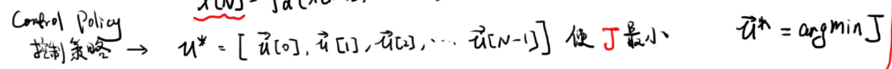
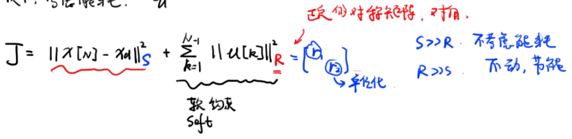
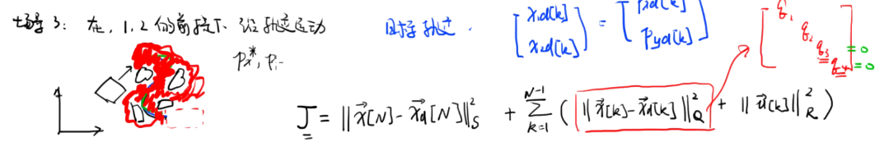
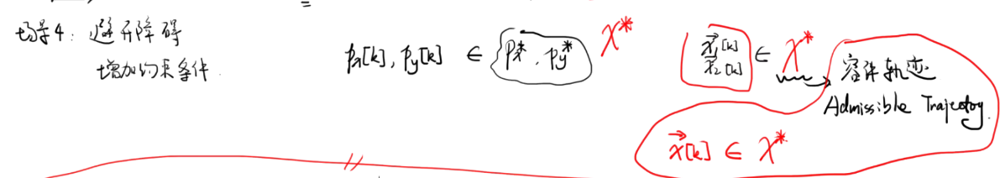
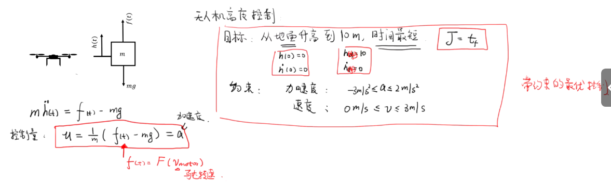

# Main Takeaway

最优控制

无论开始状态如何，我们仍将采取最优策略来达到我们的预期成果

<!--more-->

# Preview

Q：什么是好的控制

A：我们想要系统表现为我们想要的表现

对于一个系统，我们要设计$u(k)$来让在N时，$x[N]$距$x_d[N]$越近越好

于是我们定义性能指标cost func $J=(x[N]-x_d[N])^T(x[N]-x_d[X])$

> 目标就是令$J$最小
>
> 

在实际应用中，因为每个状态变量的重要性不同，所以我们给每个变量设计一个权重系数$J=(x[N]-x_d[N])^TS(x[N]-x_d[X])$，这里$S$是一个半正定的对称矩阵

> 实际中$S$常为对角矩阵，并且要将每个变量进行归一化处理（不同变量单位不一致）

实际问题中还常常带有硬约束——hard constraint

------

在上面基础上，我们来考虑能耗——常为$u(k)$大小，软约束

------

上述我们仅考虑了最后的状态，现在我们希望系统沿我们给定的轨迹运动——即考虑中间状态

------

在我们能跟踪轨迹之后，我们继续增加约束条件，然后搜索所有容许轨迹，然后进行跟踪

------

于是对于系统$x[k+1]=f_d(x[k],u[k],k)$得到我们的最终目标：

找到控制策略$u^*[k]\in \Omega,s.t.\space x[k]\in{x^*}$从$x[0]\rightarrow x_d \space to$ 
$$
\min J=h_d(x[N],N)+\sum_{k=1}^{N-1}g_d(x[k],u[k],k)
$$

> 末端代价+运行代价+输入代价
>
> 贝尔曼最优性方程

## 最优理论

> 运筹学好像学过

# 动态规划

Dynamic Programming

无后效性

## 基本概念

DP——逆向寻优和正向求解

# LQR

# References

- DR_CAN【【最优控制】2_动态规划_Dynamic Programming_基本概念】https://www.bilibili.com/video/BV1Ed4y1w7tR?p=2&vd_source=93bb338120537438ee9180881deab9c1